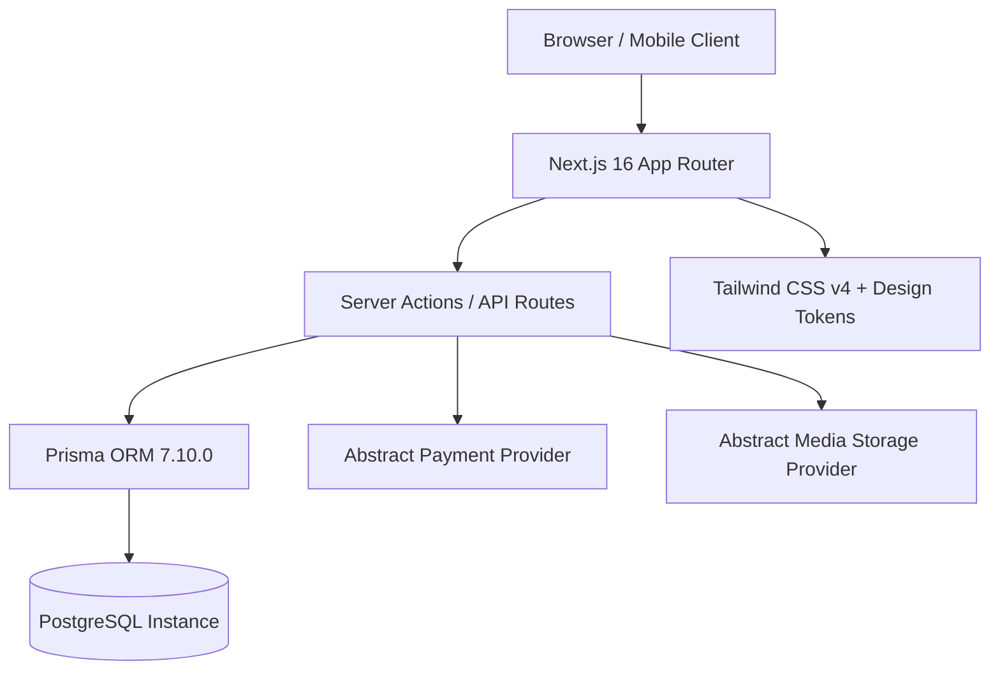

# NAAG NOOL UP — SUPABASE ARCHITECTURE EVALUATION

**Project:** Naag Nool UP  
**Document Type:** Technical Architecture Evaluation & Feasibility Assessment  
**Author:** Lead Software Architect, PostgreSQL & Security Engineer  
**Date:** September 30, 2026  
**Status:** Evaluation Completed — No Migration Executed  

---

## 1. Executive Summary

This document provides a comprehensive technical evaluation of transitioning the **Naag Nool UP** website from its current **Next.js 16 + Prisma ORM + PostgreSQL** foundation to a **Supabase-centric** or **Hybrid** architecture.

The evaluation analyzed the current Phase 1 codebase, database models, RBAC structure, media abstraction, payment abstraction, security posture, e-commerce workflows, and internationalization requirements against three specific architectural options:
- **Option A (Current Architecture):** Next.js App Router + Standalone PostgreSQL + Prisma ORM + Custom/NextAuth Authentication + S3/Cloudinary media.
- **Option B (Supabase-Centered):** Next.js + Supabase PostgreSQL + Supabase Auth + Supabase Storage + Supabase Row Level Security (RLS) via `@supabase/ssr` with minimal ORM.
- **Option C (Hybrid Architecture):** Next.js App Router + Supabase Managed PostgreSQL + Supabase Auth + Supabase Storage + Server-Side Prisma ORM with Connection Pooling (`PgBouncer` / Supabase Direct Connection).

### Core Findings & Recommendation:
1. **Supabase is technically advantageous for Naag Nool UP**, primarily by consolidating Managed PostgreSQL, built-in Authentication (Email/Password, Magic Link, Password Recovery, JWT session cookies), and Object Storage (S3-compatible bucket with image optimization) under a unified infrastructure layer.
2. **Option C (Hybrid Architecture) is the strongly recommended architecture**. It preserves the type-safe Prisma ORM schema and server-side data access layer while utilizing Supabase for managed database hosting, production-grade Auth (with JWT custom claims for RBAC: `CUSTOMER`, `ADMIN`, `SUPERADMIN`), and secure media storage buckets.
3. **No code or database changes have been made during this evaluation.** All existing Phase 1 foundations remain intact.

---

## 2. Current Architecture

The Phase 1 technical foundation established a clean, modular structure:



### Key Assets Present in Codebase:
- **Prisma Schema (`prisma/schema.prisma`):** 12 normalized models (`User`, `Product`, `ProductImage`, `Order`, `OrderItem`, `Payment`, `CommunitySignup`, `ContactSubmission`, `ContentPage`, `BlogPost`, `MediaAsset`, `SiteSetting`).
- **RBAC Foundation (`lib/auth/rbac.ts`):** Role definitions for `CUSTOMER`, `ADMIN`, and `SUPERADMIN` with server authorization helpers.
- **Service Abstractions:**
  - `services/payment/types.ts` (`initiatePayment`, `verifyPayment`, `handleWebhook`, `refundPayment`, `getPaymentStatus`).
  - `services/media/types.ts` (`uploadFile`, `deleteFile`, `getPublicUrl`).
- **Validation:** Zod schemas (`lib/validation/schemas.ts`) for forms, orders, and checkout.
- **Localization:** `config/i18n.ts` supporting `en`, `so`, and `ar` (with native RTL CSS logical properties).

---

## 3. Supabase Architecture

In a Supabase-centered or Hybrid setup, Supabase acts as the integrated Backend-as-a-Service (BaaS) and Managed PostgreSQL provider:

```mermaid
graph TD
    Client[Browser / Mobile Client] --> NextApp[Next.js 16 App Router]
    Client -.->|Public Storage & Auth State| SupabaseAuth[Supabase Auth Engine]
    
    NextApp -->|SSR Auth Session / Cookies| SupabaseSSR[@supabase/ssr]
    NextApp -->|Server Actions / Prisma ORM| SupabaseDB[(Supabase Managed PostgreSQL)]
    NextApp -->|Admin Media Uploads| SupabaseStorage[Supabase Storage S3 Buckets]
    NextApp -->|Payment Webhooks| PaymentGateway[Somali Mobile Money / Card Gateway]
```

---

## 4. Authentication Analysis

### Requirements:
- **Customers:** Email/password signup, login, session cookies, password reset, account order history.
- **Admins & Super Admins:** High-security login, route protection on `/admin/*`, RBAC enforcement.

### Supabase Auth Capabilities vs. Standalone Auth:
1. **Session & Cookie Handling:** Supabase provides `@supabase/ssr`, which seamlessly manages encrypted HTTP-only session cookies across Next.js Server Components, Server Actions, and Route Handlers.
2. **Role Representation (`CUSTOMER`, `ADMIN`, `SUPERADMIN`):**
   - In Supabase, roles are represented inside `auth.users.raw_app_meta_data` (set exclusively via server-side Service Role API, never editable by the user) or mirrored in a public `public.users` table linked via foreign key `id REFERENCES auth.users(id) ON DELETE CASCADE`.
   - Admin JWTs carry the `role` claim, enabling sub-millisecond route guarding in Next.js middleware without hitting the database on every asset request.
3. **Password Security & Lifecycle:** Built-in bcrypt/argon2 hashing, secure token generation for password recovery, rate-limiting on auth endpoints, and customizable email templates.

---

## 5. Database Analysis

### Existing Prisma Schema Compatibility:
The current `prisma/schema.prisma` is 100% standard ANSI SQL PostgreSQL:
- Uses `UUID` primary keys (`@id @default(uuid())`).
- Uses `Decimal(10, 2)` for prices and monetary totals.
- Uses `Json` columns for metadata, site settings, and address snapshots.
- Uses standard PostgreSQL `enum` types (`Role`, `OrderStatus`, `PaymentStatus`, `ContactStatus`, `PostStatus`).

### Findings:
- **Compatibility:** **100% compatible** with Supabase PostgreSQL without altering relational models.
- **What is preserved:** All table definitions, relationships (`1:N` product images, `1:N` order items, `1:1` payments), cascade rules, and indexes.
- **Modifications needed:**
  - Link `public.User.id` to `auth.users.id` via Postgres foreign key trigger or direct UUID assignment upon signup.
  - Configure Supabase Connection Pooling (Transaction mode port 6543 / Session mode port 5432) in `DATABASE_URL` for serverless Next.js deployment.

---

## 6. Row Level Security (RLS) Analysis

RLS operates at the PostgreSQL engine level, controlling table access based on `auth.uid()` and JWT claims.

### Recommended RLS Matrix:

| Entity | Public / Anon | Authenticated Customer | Admin / Super Admin | Server Engine (Prisma / Service Role) |
| :--- | :--- | :--- | :--- | :--- |
| **`products`** | `SELECT` (if `isAvailable = true`) | `SELECT` (if `isAvailable = true`) | `ALL` (CRUD) | `ALL` (Bypasses RLS) |
| **`product_images`** | `SELECT` | `SELECT` | `ALL` (CRUD) | `ALL` |
| **`orders`** | `NONE` (Guest orders queried via token) | `SELECT` (WHERE `userId = auth.uid()`) | `ALL` (CRUD) | `ALL` |
| **`order_items`** | `NONE` | `SELECT` (via parent order `userId`) | `ALL` | `ALL` |
| **`payments`** | `NONE` | `NONE` (strictly sensitive) | `SELECT` | `ALL` |
| **`community_signups`** | `INSERT` (signup form) | `INSERT` | `ALL` (View/Export) | `ALL` |
| **`contact_submissions`**| `INSERT` (contact form) | `INSERT` | `ALL` (View/Reply) | `ALL` |
| **`content_pages`** | `SELECT` | `SELECT` | `ALL` (CMS CRUD) | `ALL` |
| **`blog_posts`** | `SELECT` (if `status = 'PUBLISHED'`) | `SELECT` (if `PUBLISHED`) | `ALL` | `ALL` |
| **`site_settings`** | `SELECT` (public keys) | `SELECT` (public keys) | `ALL` | `ALL` |

### Architectural Security Principle:
> **RLS is a defense-in-depth security barrier, NOT a substitute for Server-Side Authorization.**
> All mutation operations (checkout, status changes, product creation) must still be validated in Next.js Server Actions using Zod schemas and RBAC middleware.

---

## 7. Storage / Media Analysis

### Current vs. Supabase Storage:
- **Current Foundation:** Abstract `MediaStorageProvider` interface (`services/media/types.ts`) with a local filesystem development implementation (`services/media/mediaStorage.ts`).
- **Supabase Storage:**
  - S3-compatible cloud object storage with built-in CDN caching.
  - Image transformation engine (resize, crop, WebP/AVIF auto-formatting).
  - Public bucket for product photography, logos, and blog banners (`naag-nool-public-media`).
  - Private bucket for invoices, export dumps, and internal documents (`naag-nool-private-docs`).
- **Verdict:** Implementing `SupabaseMediaStorageProvider` conforming to our existing `MediaStorageProvider` interface requires minimal code (~40 lines) and completely eliminates the need to configure separate AWS S3 or Cloudinary accounts.

---

## 8. E-Commerce Analysis

### Workflow & Transaction Integrity:
1. **Catalog & Inventory:** Stored in PostgreSQL, queryable via Prisma with instant cache revalidation in Next.js App Router (`revalidateTag`).
2. **Cart:** Client-side persisted state (localStorage/cookie) with server-side inventory verification upon checkout initiation.
3. **Orders & Checkout:** Next.js Server Action initiates the order in `PENDING_PAYMENT` state within a database transaction.
4. **Payments:**
   - Supabase does **not** process payments natively.
   - Payment provider (Visa/Mastercard/Somali Mobile Money) is triggered via our `PaymentProvider` abstraction.
   - Webhook callbacks hit `/api/payments/webhook`, verify cryptographic signatures, and execute an atomic update marking the order `PAID` and decrementing inventory.

---

## 9. Custom Admin / CMS Dashboard Analysis

The custom Naag Nool UP Admin Dashboard UI (`UI design/naag nool up admin.png`) requires a custom-built, brand-tailored administrative portal:
- **What belongs in Next.js (`/admin/*`):** Custom analytical dashboards, sales line charts, order status donut charts, recent activity streams, custom product editors, and community export tools.
- **What belongs in Supabase / PostgreSQL:** Normalized relational storage, auth credentials, audit logs, file buckets, and connection pooling.
- **Supabase Studio:** Used solely by developers/database administrators for direct database administration, backups, and SQL querying—**never exposed to the end client**.

---

## 10. Security Analysis

### Key Exposure Safeguards:
1. **`NEXT_PUBLIC_SUPABASE_ANON_KEY`:** Client-safe public key. Strictly scoped by RLS policies. Safe for browser usage.
2. **`SUPABASE_SERVICE_ROLE_KEY`:** Highly privileged server-only key that bypasses RLS. **NEVER** prefixed with `NEXT_PUBLIC_` and used strictly inside secure server-side routes/actions.
3. **Payment Secrets:** Kept in `.env.local` / production environment variables.

---

## 11. Performance and Scalability

- **Connection Management:** Supabase provides built-in `Supavisor` / `PgBouncer` connection pooling, preventing connection exhaustion during serverless Next.js traffic spikes.
- **Edge CDN:** Supabase Storage assets are distributed globally via Cloudflare CDN.
- **Database Query Latency:** Colocating the Next.js deployment (e.g., Vercel / AWS Frankfurt / London) in the same geographic region as the Supabase PostgreSQL database yields single-digit millisecond query latencies.

---

## 12. Development Experience

- **Tooling:** Supabase provides local CLI development (`supabase start` runs local Postgres, Auth, and Storage in Docker containers).
- **Prisma Synergy:** Developers maintain typed Prisma models (`prisma db push` / `prisma migrate dev`) while benefiting from Supabase's hosted dashboard and auth APIs.
- **Speed:** Drastically reduces backend boilerplate for session handling, token verification, and file uploads.

---

## 13. Cost and Operations

- **Consolidated Billing:** Database, Authentication, and Storage are combined into a single service rather than maintaining separate PostgreSQL (e.g., Neon/RDS), Auth (e.g., Auth0/Clerk), and Storage (e.g., AWS S3) vendors.
- **Backups:** Automated daily WAL backups and point-in-time recovery (PITR).

---

## 14. Vendor Lock-In / Portability

| Layer | Lock-in Risk | Portability Assessment |
| :--- | :--- | :--- |
| **PostgreSQL Database** | **Zero** | 100% standard PostgreSQL. Dumps can be exported to standard RDS, DigitalOcean, or Neon at any time. |
| **Prisma ORM Layer** | **Zero** | Standard Prisma client queries remain unchanged regardless of database host. |
| **Storage (S3 Compatible)**| **Very Low** | Standard S3 API structure. Migration to AWS S3 or MinIO requires only updating environment keys. |
| **Authentication** | **Low to Medium** | User records can be exported via SQL dump (password hashes included in `auth.users`). |

---

## 15. Migration Complexity Assessment

| Area | Complexity | Justification |
| :--- | :--- | :--- |
| **Database** | **Low** | Existing schema is 100% PostgreSQL standard; `DATABASE_URL` connects immediately. |
| **Authentication** | **Medium** | Need to configure `@supabase/ssr` client and link session to `User` table. |
| **Storage** | **Low** | Implementing `SupabaseMediaStorageProvider` takes ~40 lines conforming to current interface. |
| **Environment** | **Low** | Add `NEXT_PUBLIC_SUPABASE_URL`, `NEXT_PUBLIC_SUPABASE_ANON_KEY`, and `SUPABASE_SERVICE_ROLE_KEY`. |
| **E-commerce & Payments**| **Low** | Payment abstraction and order state machine remain identical. |
| **Testing & CI** | **Low** | Existing Jest tests remain valid. |

---

## 16. Risks and Mitigations

1. **Risk:** Accidental exposure of `SUPABASE_SERVICE_ROLE_KEY`.  
   *Mitigation:* Strict code audits and lint rules preventing `SUPABASE_SERVICE_ROLE_KEY` from being passed to client components.
2. **Risk:** Serverless connection exhaustion with Prisma.  
   *Mitigation:* Use Supabase's direct connection pooling string (`?pgbouncer=true` or port 6543) in `DATABASE_URL`.
3. **Risk:** Over-reliance on RLS leading to missed server validation.  
   *Mitigation:* Retain Zod schema validation in all Next.js Server Actions.

---

## 17. Architecture Comparison

| Area | Option A: Current Architecture | Option B: Supabase-Centered | Option C: Hybrid (Recommended) |
| :--- | :--- | :--- | :--- |
| **Database** | Self-hosted or bare PostgreSQL | Supabase PostgreSQL via Supabase JS Client | Supabase Managed PostgreSQL via Prisma ORM |
| **Authentication** | Custom / NextAuth / Lucia | Supabase Auth (`@supabase/ssr`) | Supabase Auth (`@supabase/ssr`) + RBAC sync |
| **Authorization** | Application-level middleware | RLS policies only | Application Middleware + RLS defense-in-depth |
| **Storage** | Local mock or external AWS S3/Cloudinary | Supabase Storage buckets | Supabase Storage via `MediaStorageProvider` adapter |
| **Security** | Manual security auditing | Native RLS + Anon keys | Native RLS + Server Action Zod validation |
| **E-commerce** | Prisma transactions + Payment abstraction | Supabase client queries + Payment abstraction | Prisma atomic transactions + Payment abstraction |
| **Admin/CMS** | Custom Next.js UI querying Prisma | Custom Next.js UI querying Supabase client | Custom Next.js UI querying Prisma ORM |
| **Development** | Higher configuration overhead | Fast, but lacks Prisma's typed relations | Fast setup + strongly typed Prisma models |
| **Maintainability** | Requires managing multiple distinct services | Clean, single platform | Highest clarity and architectural separation |
| **Scalability** | Manual pooling configuration required | Built-in Supavisor connection pooling | Built-in Supavisor connection pooling |
| **Portability** | High | Medium | High (standard Postgres + Prisma) |
| **Operations** | Multi-vendor operational burden | Single managed dashboard | Single managed dashboard |

---

## 18. Recommended Architecture: Option C (Hybrid)

**Recommendation: Adopt Option C (Hybrid Architecture).**

### Architectural Division of Responsibilities:
1. **Supabase Managed PostgreSQL:** Hosts the database with automated daily backups, extensions, and Supavisor pooling.
2. **Prisma ORM (Server-Side):** Remains the primary data access layer for Next.js Server Components and Server Actions. Provides strict TypeScript typing, migrations, and relationship auto-completion.
3. **Supabase Auth (`@supabase/ssr`):** Manages user registration, login, secure HTTP-only cookies, password resets, and session verification. Roles (`CUSTOMER`, `ADMIN`, `SUPERADMIN`) are mirrored in JWT app metadata.
4. **Supabase Storage:** Powers the `MediaStorageProvider` implementation for public image assets and secure private documents.
5. **Payment Abstraction:** Remains completely decoupled in `services/payment/`, ready for Somali mobile money and credit card gateway integration.

---

## 19. Migration Plan (When Authorized)

If authorized to proceed with Supabase adoption:
1. **Step 1:** Provision Supabase Project and retrieve API URLs & connection strings.
2. **Step 2:** Install `@supabase/supabase-js` and `@supabase/ssr`.
3. **Step 3:** Update `.env.local` and `.env.example` with Supabase connection pooling URLs.
4. **Step 4:** Push Prisma schema to Supabase PostgreSQL (`npx prisma db push`).
5. **Step 5:** Implement Supabase Auth helper utilities (`lib/auth/supabase.ts`) and auth middleware.
6. **Step 6:** Implement `SupabaseMediaStorageProvider` conforming to `services/media/types.ts`.
7. **Step 7:** Apply RLS security policies on database tables.
8. **Step 8:** Run test suite and production build verification.

---

## 20. Prerequisites

Before executing any migration:
1. **Supabase Account & Project Credentials:** Project URL, Anon Key, Service Role Key, and Database Connection URI.
2. **Payment Provider Confirmation:** Client input on the preferred gateway for Somali Mobile Money.
3. **Client Approval:** Sign-off on the Hybrid Architecture recommendation.

---
*Report generated and archived in `documentation/`. No implementation changes have been executed.*
